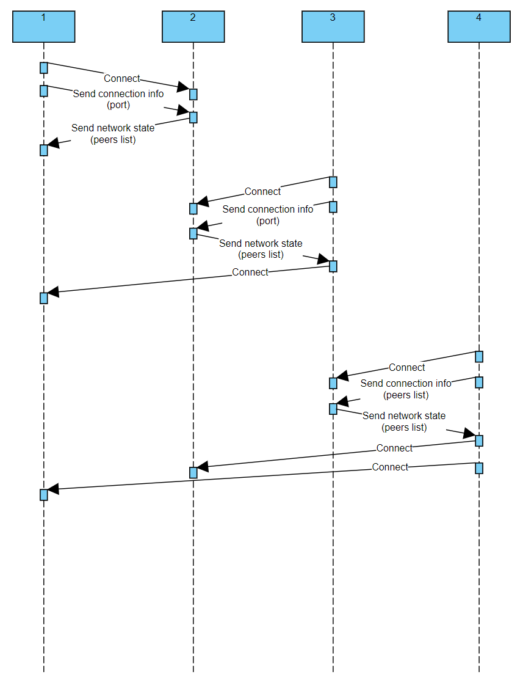

# Simple p2p network

### How to install:
```shell
# Clone repo
> git clone https://github.com/LazyMechanic/p2p-net
> cd p2p-net

# Install into $HOME/.cargo/bin
> cargo install --path .
```

### How to use:
```shell
> p2p-net --help
p2p-net 0.1
Lazy Mechanic

USAGE:
    p2p-net [OPTIONS] --port <port>

FLAGS:
    -h, --help       Prints help information
    -V, --version    Prints version information

OPTIONS:
        --connect <connect>    Another client address. Use if you want to connect to the network. If
                               omitted, then new network will be launched
        --period <period>      Period in seconds. How often to send messages [default: 10]
        --port <port>          Port on which to start client

```

### Example of usage:
```shell
# 1) Start first client
> p2p-net --port 8080 --period 5
2021-02-22T23:09:34 [INFO] - start with config=Config { period: 5, port: 8080, connect: None }

# 2) Start second client
> p2p-net --port 8081 --period 10 --connect 127.0.0.1:8080
2021-02-22T23:11:11 [INFO] - start with config=Config { period: 5, port: 8081, connect: Some(127.0.0.1:8080) }
```

First client logs:
```shell
2021-02-22T23:11:08 [INFO] - start with config=Config { period: 5, port: 8080, connect: None }
2021-02-22T23:11:11 [INFO] - accept new client: addr=127.0.0.1:8327
2021-02-22T23:11:11 [INFO] - received connection info: from=127.0.0.1:8327 msg=ConnectionInfo { port: 8081 }
2021-02-22T23:11:11 [INFO] - received text: from=127.0.0.1:8327, msg=Text { text: "9BvisA3WBlQWCvmZqgeFu4OpP1wxpr" }
2021-02-22T23:11:11 [INFO] - send message: to=127.0.0.1:8327, msg=NetworkState(NetworkState { peers: {} })
2021-02-22T23:11:11 [INFO] - update peer info: addr=127.0.0.1:8327, msg=ConnectionInfo { port: 8081 }
2021-02-22T23:11:13 [INFO] - broadcast message: msg=Text(Text { text: "fuPgiAPj1y2NVXgrLxg1eWsznVh845" })
```

Second client logs:
```shell
2021-02-22T23:11:11 [INFO] - start with config=Config { period: 5, port: 8081, connect: Some(127.0.0.1:8080) }
2021-02-22T23:11:11 [INFO] - connect: dest_addr=127.0.0.1:8080
2021-02-22T23:11:11 [INFO] - send message: to=127.0.0.1:8080, msg=ConnectionInfo(ConnectionInfo { port: 8081 })
2021-02-22T23:11:11 [INFO] - broadcast message: msg=Text(Text { text: "9BvisA3WBlQWCvmZqgeFu4OpP1wxpr" })
2021-02-22T23:11:11 [INFO] - received network state: size=0
2021-02-22T23:11:13 [INFO] - received text: from=127.0.0.1:8080, msg=Text { text: "fuPgiAPj1y2NVXgrLxg1eWsznVh845" }
```

### Connecting plan:
